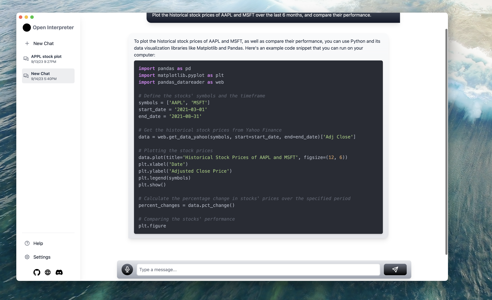

# Open Interpreter Desktop
A desktop GUI to complement the incredible [Open Interpreter](https://github.com/KillianLucas/open-interpreter)



## Table of Contents

- [Introduction](#introduction)
- [Getting Started](#getting-started)
- [Contributing](#contributing)
- [Roadmap](#roadmap)
- [Known Bugs](#known-bugs)

## Introduction

This desktop application aims to enhance the functionality provided by [Open Interpreter](https://github.com/KillianLucas/open-interpreter). While Open Interpreter provides a powerful CLI interface, this app aims to offer a more user-friendly GUI to extend its reach to less tech-savvy individuals. In its current state, the application does not use Open Interpreter, it uses the Vercel AI SDK to stream responses to the UI.

### Why This Desktop App?

- **User-Friendly**: Unlike the terminal-based interface, I want to be able to provide non-technical users with an easier method of using the platform.
- **Extended Features**: Voice-to-text using OpenAI Whisper, saved chats, minimal interface, dark mode, and more!
- **Community Driven**: Open source and open for contributions!


## Getting Started

### Prerequisites

- Node.js
- npm

### Installation

Add a .env.local file to the root directory with your OpenAI key. (OPENAI_API_Key="your key")

```bash
git clone https://github.com/tyfiero/open-interpreter-desktop.git
cd open-interpreter-desktop
npm install
npm run dev
```

## Contributing
I would LOVE any and all help on this application to make it a reality! Whether it's a bug report, a new feature, or an improvement, I greatly value your feedback.

Fork the repository.
Create a new branch (git checkout -b feature_branch).
Make your changes and commit (git commit -m 'Add some feature').
Submit a Pull Request!

...
## Roadmap
- Integrating Open Interpreter into the application, either using a node child process or waiting for the Open Interpreter npm package
- More robust locally saved chats using something better than local storage
- Locally hosted speech-to-text using Whisper. Right now it uses your OpenAI key to send an API request to OpenAI.
- Adding all the electron bells and whistles, like a menu bar icon, dock icon, hotkeys, etc.
- A model hub for downloading Huggingface models
- Any ideas you may have!

...
## Known Bugs
Please refer to the Issues tab for an updated list of known bugs. And yes, at the moment there's a couple lol
